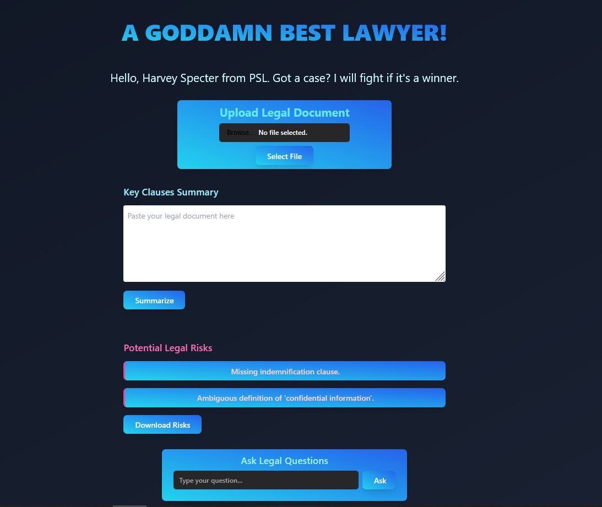

# Smart Legal Assistant

Smart Legal Assistant is a modern web application that leverages AI to assist users in analyzing, summarizing, and understanding legal documents. The platform enables document upload, clause extraction, risk detection, and interactive legal Q&A—all through an intuitive interface.

---

## 🚀 Features

- **Document Upload:** Upload legal documents in `.txt` or `.pdf` formats.
- **Clause Extraction:** Automatically identifies and summarizes key clauses.
- **Risk Detection:** Highlights potential risks or missing clauses in contracts.
- **Legal Q&A:** Ask legal questions related to the uploaded document and receive AI-generated answers.
- **Modern UI:** Responsive frontend built with React and Tailwind CSS for a seamless user experience.
- **Backend AI/NLP:** Python Flask backend powered by Hugging Face Transformers for NLP tasks.

---

## 💻 Getting Started

### Prerequisites

- [Node.js](https://nodejs.org/) (for frontend)
- [Python 3.8+](https://www.python.org/) (for backend)
- [MySQL](https://www.mysql.com/) (for database)

### 1. Clone the Repository

```bash
git clone https://github.com/heatblaze/Smart-Legal-Assistant.git
cd Smart-Legal-Assistant
```

### 2. Setup Backend

```bash
cd backend
python -m venv venv
```

### 3. Setup Frontend

```bash
cd ../
npm install
npm start
```

---

- React app: [http://localhost:3000](http://localhost:3000)
- Flask backend: [http://localhost:5000](http://localhost:5000)

---

## 🧰 Tech Stack

- **Frontend:** React, Tailwind CSS
- **Backend:** Flask, Hugging Face Transformers, SQLAlchemy, MySQL

---

## 📷 Screenshots



---

## 🙏 Acknowledgments

- [Hugging Face](https://huggingface.co/) for open-source NLP models
- [Tailwind CSS](https://tailwindcss.com/) for UI styling

---

*For questions or contributions, please open an issue or pull request!*


